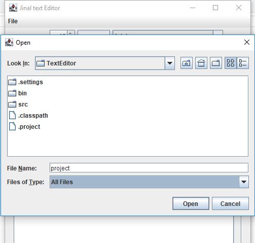

# swingTextEditor
jinalTextEditor is a simple and light text editor (notepad) written in Java using Swing toolkit.

# It has following various functionalies:

Basic display and scrolling: the editor can display the contents of a file in a window along with vertical scrollbars.
Reading and writing files: the editor should require a single command-line argument giving the name of the file to edit. If the user types Control-s, the editor should save the current contents of the document back to the file.
Newlines: if the user types the Enter or Return key (which corresponds to the Control-r character, or "\r"), you should insert a newline character ("\n") in the document and display a new line in the window.
Backspace and delete: if the user types the Backspace key, the editor is able to delete the character immediately before the cursor (unless there is a selection; see below). The Delete key should delete the character at the cursor location.
Selection: if the user presses the mouse button and drags the mouse either forward or backward, the editor is able to create a selection corresponding to the range of characters between the character where the mouse was pressed and the current mouse location. The new selection replaces any previous selection. The selection must be displayed using some form of highlighting, such as a colored background or reverse video. Once a selection has been made, if the user presses the mouse button while holding down the Shift key, then the selection should be modified as if the mouse button had never been released (i.e. the current mouse position specifies one end of the selection, and the other end of the selection is determined by the location where the mouse was clicked without the Shift key down). If the mouse button is pressed and released without dragging, then any existing selection is canceled. You do not need to implement word selection for double-clicks.
Selection deletion: if a printable character or newline is typed at a time when there exists a selection, then the new character must replace the selection. If Backspace or Delete is typed when there exists a selection, then the editor should skip the normal behavior for these keys and simply delete the selected characters.
Copy and paste: if the user types Control-c, the editor should copy the selected characters to the clipboard, where they can be pasted by other applications. If the user types Control-v, the editor must read the contents of the clipboard and copy it to the cursor location (deleting any selected characters first). You must use Swing/AWT facilities for copying and pasting, so that you can select in this window and paste in other applications, and vice versa.
Able to Select new file, open new file and save existing file functionalities.

# Some of the Screenshots captured from application are as follows:

# AUTHOR
Jinal Kalpesh Shah

# DEMO
Download the Jar file and double click to run

Or run java -jar jinalTextEditor.jar from the command line

